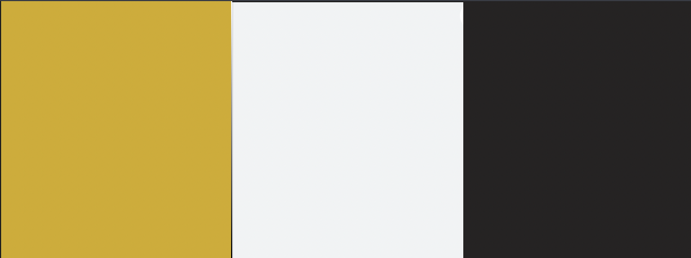

<h1 align="center">UCFD Milestone Project - Daft Punk's Discography Webpage</h1>

This is front end only webpage that is designed for a French electornic music group called DaftPunk
This webpage is designed for fans and followers to keep up to date with current and future music releases 
as well as past. The website provides a detailed history on the musics groups life, audio media where
you can listen to there music, extrenal social links where you can connect with the group 
or buy merchandise as well as a page where you can register your email to always keep up to date with 
future music releases. 

 This webpage is designed as part of my Code Institutes Full Stack Diploma, Please click the link below to view my webpage:
 [Click Here](https://wilko90.github.io/UCFD-Milestone-Daftpunk-Discography/)

 This project is developed using *HTML* and *CSS*, with a small bit of simple *Javascript* to aid with functiality. 

<h1>UX</h1>

# Stratergy

## Research

__What does a user want to gain from browsing an Artists Discography?__

"I want to know about future releases" "I want to be able to browse and listen with a user friendly interface"  "I want to understand more about the artists history"

## Competitor Review

[All Music](https://www.allmusic.com/) - Difficult to navigate to audio content, not user friendly.

[Daft Punk Fandom](https://daftpunk.fandom.com/wiki/List_of_Daft_Punk_releases) - Messy interface difficult too navigate, can easliy get lost.

[Rate Your Music](https://rateyourmusic.com/artist/daft-punk) - No internal audio content, over crowded with information

## Business Approach
### <ins>Mission Statment</ins>
* What do you offer to your audience?
* What makes your audience attracted to you?
* create online presence 
    * Provide quailty and self expression
    * Increase brand awareness
    * showcase music content in a user freindly environment
    * Store and organize personal music collection for free 

### <ins>Branding</ins>
   * Make the branding eye catching, referable, attractive
   * Match style of branding with pages, repetition on aestheics 
   * Apply branding through out
   * Minimalistic approach 

### <ins>Content</ins>
  * Intuative and eye catching design, minimal, interaction on every page 
    * stylistic and colour co-ordination that matches the artists attire
  * Intial minimal content but bold grabbing the users attention
    * Provide more in depth content for user to explore 
  * Call to action points easliy located and naviagle to engage user
    * Easy, user friendly proccess to start that inital contact   

### <ins>Pricing</ins>
   * The database and site functionality are to remain free to use
      * Alternate links to buy from external source if user wants to engage further this is appernt to user with one click of a button 
   * No hidden fees or costs   
    

 

## User stories

This website is designed for fans to find all the information on the music duo's Discography in a simplistic user friendly webpage
Below you can find the following user stories that were brainstomred as part of the planning process. 

* As a visiting user I want to browse the duo's music discography so that I can listen to there past and current releases
 
* As a visiting user I want to learn more about past releases and know where I can purchase there music

* As a visiting user I want to understand more about the music artists history

* As a visiting user I want to be directed easily to the duos social media where I can contact them for any potential bookings

* As a visiting user I want to be able to register my email so that I can keep up to date with any news or future releases

# Scope

## Website Requirements

#### <ins>User Needs</ins>

* Website is simple,user friendly, minimalistic design
* Branding is bold, stands out, eye catching
* Content to be navigable  

#### <ins>Engagment</ins>

* Call to action points clear and noticable
* Engagement with a simplistic form
* All pages keeps engagement clear and easy to locate over existing features. 

#### <ins>Translates / Purpose</ins>

* Main description of artists discography on home page
* Make further details of artists discography on alternate pages
* Make the descriptions simple and straight to the point 

# Structure

## Home Page

* Engages user with artists logo/brand
* Call to action point bold, stands out for initial contact
* Proivides user with full break down of the artists 
* <ins>User Aims</ins>
    * Simplicity/navigable 
    * Attraction
    * Explains database
* <ins>Artists Aims</ins>
    * Strengthen following
    * Engagement
    * Understand the database   

## Discography

* Explain how the database works
* Explain, store and orginasie artists collections
* Consistent structure
* <ins>User Aims</ins> 
    * Information easily attained
    * Presentation intuative
    * Good structure 
* <ins>Artists Aims</ins>
    * Sell the brand
    * Grow database
    * Clear on objective

## About

* Clear understanding of artists
* Sustain users knowledge
* User friendly/simple
* <ins>User Aims</ins>
   * Acquire information 
   * Understand the artists
   * Be curious 
* <ins>Artists Aims</ins>
   * Inform user
   * Create a meaningful relationship 
   * persuade user to engage further

## Contact

* Allows user to connect directly with a form
* Simple and navigable point of contact
* Linea naritve style interaction
* <ins> Users Aims </ins>
   * Ease of access 
   * Minimal data needed for initial engagement
   * Eye catching call to action
* <ins> Arists Aims</ins>
   * Engagement
   * Aquire user Information/feedback
   * Understand your users

# Skeleton Plane
### <ins>Wireframes</ins>

All wireframes are the core skelteton to aid in the planning process and are not the final look of the design. I recommend that the PNG's are downloaded to be viewed in your own browser.  

-  [Home Page Wireframe All Devices](https://github.com/wilko90/UCFD-Milestone-Daftpunk-Discography/blob/master/static/wireframes/home.png)
-  [Discography Page Wireframe All Devices](https://github.com/wilko90/UCFD-Milestone-Daftpunk-Discography/blob/master/static/wireframes/discography.png)
-  [About Page Wireframe All Devices](https://github.com/wilko90/UCFD-Milestone-Daftpunk-Discography/blob/master/static/wireframes/about.png)
-  [Contact Page Wireframe All Devices](https://github.com/wilko90/UCFD-Milestone-Daftpunk-Discography/blob/master/static/wireframes/contact.png)

# Surface Plane

## Brand Image
The branding Image or better known as a logo is a key aspect to draw attenttion to the user. Intially I chose a popular image that is associated with the artists 2001 album "discovery" 
unfortuanly this image clashed with my over all theme, therefore I went for a more subtle and stylistic approach which complimented the theme of the project which the idea was taken from the 2013 album cover 
"Random Access Memories". The logo was downloaded as a PNG for its transparency benefits. Logos where taken from a free to use website called [pngwing](https://www.pngwing.com/).

* First Idea - [Initial logo](https://w7.pngwing.com/pngs/659/114/png-transparent-daft-punk-logo-punk-rock-daft-punk-angle-text-black-and-white-thumbnail.png)
* Final Idea - [Current logo](https://w7.pngwing.com/pngs/305/972/png-transparent-united-states-logo-organization-information-service-daft-punk-angle-trademark-service-thumbnail.png)

## Colour Schemes

A colour scheme is one of the first elements to communicate the message behind the design on both visual and psychological levels.
The process of choosing my pallet was inspired with the artists costume choice from the album [Random Access Memories](https://en.wikipedia.org/wiki/Random_Access_Memories#/media/File:Random_Access_Memories.jpg) 
which combinines black,white and gold, which achives a stylish, easy on the eye look. All colours were generated on [html Color Codes](https://htmlcolorcodes.com/color-picker/).

The final colour choices where assesed with in the guidlines of [Web Content Accessibility Guidelines](https://www.w3.org/TR/WCAG20/) Each colour was used with [Contrast Ratio](https://contrast-ratio.com/#%23212121-on-%23F0F3F4) and graded with in the guidlines of [W3](https://www.w3.org/TR/WCAG20/) .

* Light black (#212121)aginst off white back ground(#F0F3F4) (AAA Standard)
* Light grey (#6C757D) against off white background (#F0F3F4) Which fails a (AA standard) by 4px. To fit in with my design ideas for a sleek finish I settled with a slight darker grey of #616161 (AA Standard)
* Dark gold text (B7950B) against black backgorund (#212121) (AA Standard)    

Below are the final colour choices for my project

* Background Colour is off white (#F0F3F4)
* Primary Font Colour lighter shade of black (#212121)
* Muted fonts (#616161)
* Primary and secondary buttons are shades of gold (#D4AC0D)
   * Hover CSS (#B7950B) 
   * Border (#fff)
* Repeated call to action points at the head of the page
  * Font colour dark gold (#B7950B) whith a white off button (#F0F3F4)
  * When hovered turns to dark gold (#B7950B) to interact with the user. 
* Social links light shade of black #212121) against off white backgorund (#F0F3F4)
  * Hover CSS (#D4AC0D) 

## Typography 

[Roboto](https://fonts.google.com/specimen/Roboto) font was used to keep a minimalistic design through out my project to help maintain consistency. Font taken from [Google Fonts](https://fonts.google.com/)
Font weights used from 300,400 and 500 for an easier reading experiance.

## Images

The majority of the images used come from various websites from  [google images](https://www.google.com/search?q=daft+punk&sxsrf=ALeKk01K83Y46gV6bW7IWsCVMwhTjz7ZIQ:1611326366247&source=lnms&tbm=isch&sa=X&ved=2ahUKEwibnbW94q_uAhWROcAKHdHzBFsQ_AUoAXoECBMQAw&biw=1590&bih=837&dpr=2)
when you search daft punk, all images used will be credited in the credits section of my readme.
The nav bar Image and footer Image was designed by my girlfriend which was created on an app called [Procreate](https://procreate.art/).

## Visual Interactions

# Features

- Desktop,tablet and mobile responsive giving the user flexability.
- Simplistic design which will help users navigate through out the web page with ease.
- Interactive header image that is displayed on all pages to remind the user of the brand and when clicked will navigate back to home page.
- Clear call to action buttons allowing users to know what to do next and make that initial contact.
- Social icons clearly makered at the foot of the page. Allowing the user to interact further with the artits social sites.
- Media player with controls - lets the user be more interactive with 
- Embeded video with controls - helps the user   

In this section, you should go over the different parts of your project, and describe each in a sentence or so.
 
### Existing Features
- Feature 1 - allows users X to achieve Y, by having them fill out Z
- ...

For some/all of your features, you may choose to reference the specific project files that implement them, although this is entirely optional.

In addition, you may also use this section to discuss plans for additional features to be implemented in the future:

### Features Left to Implement
- Another feature idea

## Technologies Used

In this section, you should mention all of the languages, frameworks, libraries, and any other tools that you have used to construct this project. For each, provide its name, a link to its official site and a short sentence of why it was used.

- [JQuery](https://jquery.com)
    - The project uses **JQuery** to simplify DOM manipulation.

## Testing

In this section, you need to convince the assessor that you have conducted enough testing to legitimately believe that the site works well. Essentially, in this part you will want to go over all of your user stories from the UX section and ensure that they all work as intended, with the project providing an easy and straightforward way for the users to achieve their goals.

Whenever it is feasible, prefer to automate your tests, and if you've done so, provide a brief explanation of your approach, link to the test file(s) and explain how to run them.

For any scenarios that have not been automated, test the user stories manually and provide as much detail as is relevant. A particularly useful form for describing your testing process is via scenarios, such as:

1. Contact form:
    1. Go to the "Contact Us" page
    2. Try to submit the empty form and verify that an error message about the required fields appears
    3. Try to submit the form with an invalid email address and verify that a relevant error message appears
    4. Try to submit the form with all inputs valid and verify that a success message appears.

In addition, you should mention in this section how your project looks and works on different browsers and screen sizes.

You should also mention in this section any interesting bugs or problems you discovered during your testing, even if you haven't addressed them yet.

If this section grows too long, you may want to split it off into a separate file and link to it from here.

## Deployment

This section should describe the process you went through to deploy the project to a hosting platform (e.g. GitHub Pages or Heroku).

In particular, you should provide all details of the differences between the deployed version and the development version, if any, including:
- Different values for environment variables (Heroku Config Vars)?
- Different configuration files?
- Separate git branch?

In addition, if it is not obvious, you should also describe how to run your code locally.

## Credits

### Content
- The text for section Y was copied from the [Wikipedia article Z](https://en.wikipedia.org/wiki/Z)

### Media
- The photos used in this site were obtained from ...

### Acknowledgements

- I received inspiration for this project from X
