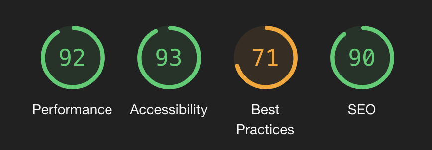
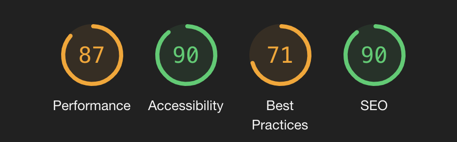
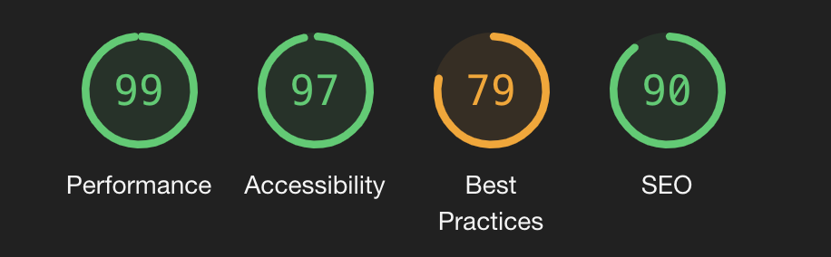
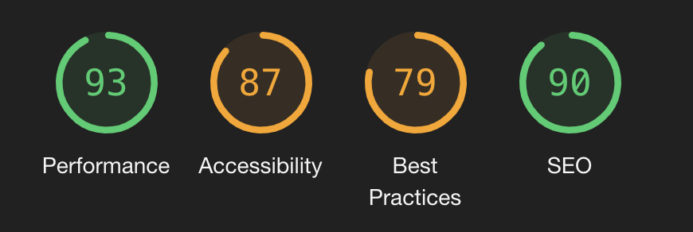

<h1 align="center">UCFD Milestone Project - Daft Punk's Discography Testing Sction</h1>

For full readme [click here](README.md)

# Table of Contents

1. [User Story Testing](#user-story)
2. [Features Testing ](#features-testing)
3. [Further Testing](#further-testing)
4. [Browser Testing](#browser-testing)
5. [Validation Testing](#validation-testing)
6. [Bugs](#bugs)

# User Story Testing 

## "As a visiting user I want to browse the duo's music discography so that I can listen to their past and current releases".

 On initial contact with the home page you will see the company's logo, a call to action, four navigation links, large powerful imagery and a title. If a user requires to browse the artist's music they can do so in three possible ways: Navigate to the `discography` link on the navbar, click the C2A `find more` on the home page or click either of the sample releases that are also on the home page. Each process will navigate the user to freely browse and listen to music of their choice with ease. 
*  The concept is simple, efficient and an effective way to browse and listen to releases.
* All releases have a stylish yet easily readable title, tracklist, a large image, and media controls to play, pause, stop and adjust the volume. 
* To allow flexibility for the user, all content is responsive to all devices and view ports which will arrange content neatly, increasing fluidity. 

## "As a visiting user I want to learn more about where I can purchase their music"

 If a user wanted to purchse any music they had listend to, they can by navigating to the `discography` page and under the desired release, there is a C2A button `link to buy`. This will open a new tab leading straight to a trusted third party webpage for private sellers.

* The C2A buttons are designed with the same style and tones as all the webpages. There is also a minimal degree of interactivity with a slight colour change when hovered over.
* Each C2A section will break down neatly when viewed in alternate devices or viewports, allowing flexibility for usage.

## "As a visiting user I want to understand more about the music artist's history"

For a user to obtain more information on the artits they can click on the `about` link on the nav bar or click the C2A `Click For Bio` that is located under the artists section on the home page. 
* Once user is on the `about` page, they will find text information about artist's history. This is wrapped neatly around an image of the artists. This represents the design chocies and overall feel of the webpage to give the user a visually pleasing experience.
* On different smaller viewports, the image of the artists is hidden to allow the page to be fully respsonsive on mobile devices.
* The user also has a choice to watch a brief documentary of the artists that is sitting just below the text under a title called "Evolution". This also features media controls to play, stop, pause, adjust the volume, make media full width of the screen, and an option to download.
* Media player is fully repsonsive and will render down to be viewable on all devices and viewports.
* The colour choices, structure and design of the about page is consistent.

## "As a visiting user I want to be directed easily to the duo's social media pages"

Three social media links are located in the footer of every page under the 'connect' heading. This will send the user to a new tab (so the user is only temporarily diverted) to either `Facebook`, `Youtube` or `Instagram`.

* Each social media icon has the logo to represent each social page and is desgined with the same aesthetics and colour scheme of the webpage, all housed in a slim circular border.
* Social media links reduce in size when viewed on smaller viewports and devices so the links are in keeping with the aesthetics of the page.
* Interactivity is showed when the user hovers over a social link, changing to the colour of gold.

## "As a visiting user I want to be able to register my email so that I can keep up to date with any news or future releases"

The call to action that the user is presented with when they arrive to the site is the main point of contact for a user to register for the newsletter. Alternatively, the user can navigate to the `contact` section, where they can also register to the newsletter or submit an enquiry.
* When the C2A button on the `Home` page is interacted with it will turn gold to match the colour scheme.
* To ensure a user friendly interface, the user will only need to interact twice to register by inputting their email address, then submitting by clicking the gold `Sing Up` button.
* Alternatively, the user can obtain a more personal response by submitting an equiry. This is located in the `contact` page on the navbar.
* Both the contact form and newsletter require the correct information to be inputted, or the user will be unable to submit their data.    

# Features Testing 

## Desktop, tablet and mobile responsive

Mobile responsiveness is extremely important for maintaining consistent traffic towards a webpage, as there are nearly six billion mobile users in the world today. (stat pulled from [99 Designs](https://99designs.co.uk/blog/tips/responsive-web-design-key-tips-and-approaches/)) Intial testing that my webpage was fully responsive was used with [Google Dev Tools](https://developers.google.com/web/tools/chrome-devtools). This can be accessed using a chrome browser by right clicking on your mouse and clicking `inspect`. Within this feature, you can toggle towards the device tool bar which will list various tablet and mobile screen sizes to test that your webpage is repsonsive on specific device. The testing criteria below was considered on all pages avliable to the user.

* To ensure responsiveness, every page runs fluid with each other, and each feature remains dynamic and inline.
* Text, controls, and images must be aligned and properly placed across the site.
* The content location should be dynamic as screen resolution changes.
* Buttons must be well-adjusted and of suitable sizing.
* Colour, shading, and gradient must be consistent throughout.
* All text remains readable on all devices.

### Home page
* Call to action button is visible on tablets and desktop.
  * Call to action disappears on mobile devices, but reappears when device is horizontal. 
* Logo and navbar icon are visible and alinged.
  * Navbar contents when collapsed is centered and remains fluid with content beneath.
  * Navbar text is the correct colour and sizing is proportionate.
  * Nav bar icon on screen sizes of 280px or less remain in line with logo 
* Carousel is active and in line with content above and below.
  * Image resolutions remain intact.
  * Slide indicators are removed when viewing on screen sizes of 576px and below.
* Display-4 title and paragraph text below remain readable, centered and static
* Discography sample images are split into different coloumns within respective viewports and are dynamic with each other.
  * Titles are readable, centered and inline.
  * Media controls are centered and sit fluid with image and text.
* Artists Image cards remain within the margins and do not overflow.
  * Text has reduced in size for viewports of 768px and below. Also centered.
  * `Click for Bio` buttons are sized inline with text and headings.
* Social heading "connect" and link icons are reduced in size for smaller viewports and remain responsive to all devices.

### Discography
* Titles are readable, centered and inline.
* Discography image cards are dynamic, margins inline and resolution remains high.
  * Text is aligned and centered.
  * Media controls aligned and centered. 
  * `Link to buy` button text and border radius reduced in 768px and reduced again in 576px.

### About
* Text to wrap around image fluidly, is readable and alinged correctly on large and medium view points.
* Image aligned to the left of the page sitting on text with correct margin.
  * Image removed when viewed on small viewports.
* Evolution video with appropriate padding for all viewports and aligned neatly.
  * Controls to reduce in size and remain dynamic and fluid with padding.
  * On smaller viewports, it is recommended the user view the media in full screen.

### Contact
* Call to action title and button removed.
* Ensure that the "Contact us" and "Newsletter" sections sit in appropriate coloumns. 
  * On smaller Viewports, both sections sit neatly in a stacked view
  * Text content to reduce in size but remain readable in small viewpoints
  * `Send` and `Subscribe` buttons reduce in size when viewed in a small viewpoint.  

## Modal Testing

All functions below were tested on every page with desktop, tablet and mobile devices.

As the modal is only for demonstration purposes, the content submitted will not be registered and the user will be shown an error "405" message, resulting in the user pressing the back button to be returned to the page. 

* Ensure that the modal is displayed centrally above the navbar 
* Ensure that the modal appears centrally once activated
* Ensure that you can exit by clicking the cross 
* Ensure sure you can exit by clicking `esc` on your keyboard 
* Ensure you can exit by clicking with your cursor away from pop up
* Ensure that all text is visible and readable
* That the `Sign Up` button is visible, the correct colour and the hover class is active.
* Ensure that the `Sign Up` button is clickable 
* Ensure that the place holder text disappears when user is inputting data
* If no data is inputted but user clicks submit, that an error message is dispalayed "! please fill in this field"
* Ensure that if the user does not enter a valid email address with an "@" a error message appers when submited "! please inlcude a '@'"
* Ensure that once submited the user is diverted back to their current webpage.
* Ensure the modal is not displayed when on the Contact page.

## Navigation Bar 

All functions below were tested on every page with dektop,tablet and mobile devices.

* All navigation links are active and send user correctly to the desired location
  * `Home`-`Discography`-`About`-`Contact`
  * `Discography`-`About`-`Contact`-`Home`
  * `About`-`Contact`-`Home`-`Discography`
  * `Contact`-`Home`-`Discography`-`About`
* Ensure all navigation links are in correct order on all active links 
* Ensure that the logo image is active and once clicked always reverts back to the `home`page
  * This was tested on all pages
* Ensure that the navigation links Hover Classes are active and underlined with a white line once interacted with when in desptop view.
* Ensure that the navigation background image is static and the resolution is high.
* Ensure the navbar height is consistent between pages
* Ensure that navigation links do not open in a new tab.
* Ensure the Navbar remains sticky when scrolling down the webpage
* Ensure that the active link remains different from inactive links
* Ensure logo remains same size when viewed on tablet and mobile device
* Ensure Burger icon activates when in mobile device or small viewports
* Ensure burger icon collapses when active and navigation links appear centered and readable.
* Ensure Burger Navigation links disappear when burger icon is not active

## Footer

All Functions below were tested on every page with dektop, tablet and mobile devices.

* Ensure footer is positioned at the bottom of every page
* Ensure the hover styling is active when cursor is active on social links (desktop)
* Ensure each social link sends to correct destination
  * Facebook-Facebook
  * Instagram-Instagram
  * Youtube-Youtube
* Ensure each social site appears in a new tab
* Ensure footer remains static on all viewports
* Ensure social links remain in the correct order on all links
 * Facbook-Instagram-Youtube

## Media Players

### Audio
 All functions below were tested on every page with dektop, tablet and mobile devices.
 * Media does not start unless interacted with
 * Media controls visible, static and are responsive in lower viewports, tablet and mobile
   * `Play`,`Pause`,`volume`, `scrubbing toggle`,`download` option
* Correct media is linked with the correct player
* Media starts when `play` button is initiated
  * Media will not stop playing if another track is selected and played, causing audio to overlap. To prevent this, java script is required. [Stack Overflow](https://stackoverflow.com/questions/43430897/javascript-to-stop-playing-sound-when-another-starts)
* Media pauses when `pause` button is initiated
* Media mutes when `mute` button is initiated
* `Volume toggle` when initiated decreases or increases volume (only on desktop)
* Media can be scrubbed forwards and backwards with toggle
* Media downloads when download button is initiated.
* Media player compatible with Safari, Chrome, Mozilla, Microsoft Edge (tested on latest versions)
* 'Incompatible browser' text is not shown when compatible.
* All testing was done on the latest verions of these web browsers. Audio worked throughout. Here is a link with browsers that support the `audio` tag and the version that is supported [link](https://www.w3schools.com/tags/tag_audio.asp).
* Compatibility was not checked on older versions of web browsers.

### video
 All functions below were tested on every page with dektop, tablet and mobile devices.
* Media does not play unless intiated
* Media is visible, static and are responsive in lower viewports, tablet and mobile.
* Media controls are visible
 * `Play`,`pause`,`scrubbing toggle`,`mute`,`volume bar` to increase audio higher, lower (desktop only) Fullscreen option, download option.
* Media starts when `play` button is intiated
* Media pauses when `pause` button is intiated
* Sound stops when `mute` button is initiated
  * Sound starts again when `mute` button is turned off
* Volume toggle increases and decreases volume (desktop only)
* Media can be moved forwards or backwards with scrubbing toggle
* Fullscreen option opens when initiated 
* Media downloads when `download` button is initated
* Media player compatible with Safari, Chrome, Mozilla, Microsoft Edge (tested on latest versions)
* All testing was done on the latest verions of these web browsers. Audio worked throughout. Here is a link with browsers that support the `video` tag and the version that is supported [link](https://www.w3schools.com/tags/tag_audio.asp).   
* Compatibility was not checked on older versions of web browsers.

# Further Testing 

### Forms 

All functions below were tested on every page with dektop, tablet and mobile devices.

* Ensure the form text is readable and centered in container
* Ensure all place holder text is in the correct sections
* Ensure that the `Send` button is visible, centered and the hover styling is active
* Ensure when `Send` button is initiated without any input in the text fields that an error message appears '! Please fill in this field'.
* Ensure all fields need appropriate data added before submiting  
  * Valid Email address with @ in email field 
  * Number required in number field  
  * Text in Name field
  * Text in Query field

### Carousel

All functions below were tested on every page with dektop, tablet and mobile devices.

* Ensure that three images are attached to the Carousel
* Ensure the image resolution stays high in different viewports and devices 
* Ensure that the indicators are present on medium/large viewports
* Ensure that that indicators are working to show next and previous images
* Ensure that the image automatically alternates after 10 seconds
* Ensure that carousel is working in multiple browsers (browsers listed in 'browser testing')

# Browser Testing 
All browser testing was done with the same method above
* Problems usually occurred when my CSS was not compatible with most browsers. Running my CSS code through a [Auto-Prefixer](https://autoprefixer.github.io/) solved these compatibility issues.

## Chrome-Microsoft Edge 
* All testing approved

## Firefox
* No download button on audio or video players
  * Instead, right click and 'save as' to download 
* All other testing approved

## Safari
The Responsive test on Safari was done by enabling the built in "responsive mode" tag. This is enabled via the advanced settings.
* Stacking issues with the navbar
  * Fix by adding a `display: -webkit-box;` to `.banner-image` class.
  * Fix found at [Stackoverflow](https://stackoverflow.com/questions/35137085/flexbox-code-working-on-all-browsers-except-safari-why)
* No volume controls on audio media player
* No Download button
  * Required to right click and 'Download'
* All other testing approved 

 ## Internet Explorer 11
Testing Internet Explorer was a problematic process. My computer is not compatible with this browser and due to the current pandemic, I could not make use of any library facilities or locate a computer which was compatible.
 To overcome this problem, I used a cross browser tesing platform called [Browserling](https://www.browserling.com/). Here I was able to test a three minute session free of charge. 
 Due to the time restrictions, I was unable to test all of the features. Below are a list of errors that I found: 

* Audio media loading with an error
* Text not wrapping around image on about page
   * `shape-outside` class has compatability issues [caniuse](https://caniuse.com/?search=shape-outside)

Testing validity may have been limited due to potential compatiblity issue with Browserling. 
Circumstantial factors limited my ability to thoroughly test Internet Explorer for this project. 
In future I would plan to locate a computer which is compatible with Internet Explorer so I can test it properly.

 # Validation Testing 

### Validation tetsing was done with two third party applications  [W3 Validator](https://validator.w3.org/) for `html` and [Jigsaw Validator](https://jigsaw.w3.org/css-validator/) for testing `CSS`.

### html validation Errors

* Fixed by removing the `target="_blank"` from the `<i>` tag 

* Fixed by changing `aria-labelledbye` class too `aria-label` tip from [Stack Overflow](https://stackoverflow.com/questions/39831658/how-to-fix-the-aria-labelledby-attribute-must-point-to-an-element-in-the-same-d)

* No other errors present 

### css validation errors 

css validation errors 

* After reseraching the issue the css validator sometimes does not recognise prefixed properties. During my testing phase, I did not encounter any errors because of this.

* Error above is due to a built-in bootstrap css class. Researched here at [Stack Overflow ](https://stackoverflow.com/questions/51495866/bootstrap-4-0-0-fail-w3c-validation).

## Google Light House Testing

This feature is an open source, automated tool for measuring the quality of a webpage. Any issues shown have been addressed below. 

## Home page

## Discography Page 

* Low 'Best Practices" due to external links ('might not be safe') for the user to be able to purchase a certain discography. As a frequent user of the third party site that the buttons are linked to, I can confirm it is safe.  
*Images saved in 'JPG' or 'PNG' increase download time. It is recommended that image files are formatted in 'JPEG 2000' and 'JPEG XR' due to advanced compression rate. On personal testing of the page, I did not encounter any problems due to this. The performance was not affected. 

## About Page

## Contact Page 

* Accessibility issues 
  * Contrast ratio of the text and the background colours would fail [W3](https://www.w3.org/TR/WCAG20/). I felt it would affect the over all aesthetics and colour theme if I made this change, so I did not change it.
  * No discernible names attached to the soical links.
    * As this project is intended to be minimalistic, adding text contact may hinder that.
  * Logo image is at incorrect aspect ratio
    * The Image ratio has been reduced to '200 x 100' to fit the nav bar, on visual testing this fits the visual aesthetics intended.

# Bugs 

* Navbar background image
  When making a subfolder for the `stylesheet.css` in the `static` folder I came across an issue resulting in the navbar background image not been displayed. Finding no solution, I had to revert back to the `stylesheet.css` being placed to it's original source. 

* Sticky Navbar
  * I encountered an issue with the `sticky-top` bootstrap class on the nav bar. When scrolling down the webpage the nav bar would dissapear half way down. Issues that cause this can be a height added to the parent element [Github](https://github.com/twbs/bootstrap/issues/21919) subsequently by removing the height property from the body element and adding it to the html element. This fixed the issue. 

