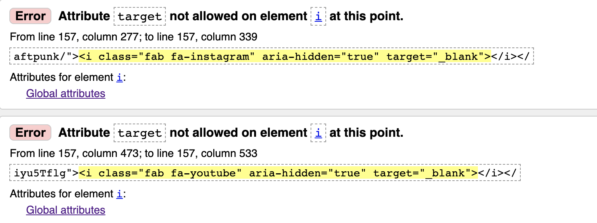
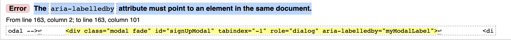
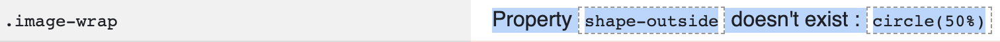
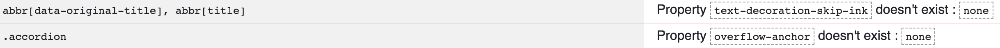

<h1 align="center">UCFD Milestone Project - Daft Punk's Discography Testing Sction</h1>

# User Story Testing

## "As a visiting user I want to browse the duo's music discography so that I can listen to there past and current releases".

 Initial contact with the home page you will see the compmanys logo, a call to action, four navigation links, large powerful Imagery and a title. If a user requires to browse the artist's music they can do so in three possible ways, Navigate to the `discography` link on the navbar, click the C2A `find more` on the home page or click either of the sample releases that are also on the home page. Each process will navigate the user to be able to freely browse and listen music of there choice with ease. 
*  The concept is simple, efficent and an effective way to browse and listen any desired releases of the users choice.
* All releases have a stylish yet easy readable title, tracklists, a large Image, and media controls to play,pause,stop and adjust the volume. 
* To allow flexibility for the user all content is responsive to all devices and view ports which will arrange all content neatly and readable. 

## "As a visiting user I want to learn more about where I can purchase there music"

 If a user wanted to purchse any music they had listend too they can by navigating to the `discography` page and under there desired release there is a C2A button `link to buy` this will open a new tab leading straight to a trusted 3rd party webpage for private sellers.

* The C2A buttons are designed with the same style and feel as all the webpages, also with a minimal degree of interactiuvity with a slight colour change when hoverd over.
* Each C2A section will breack down neatly when viewed in alternate devices or viewports allwing flexibility for the user.

## "As a visiting user I want to understand more about the music artists history"

For a user to obtain more information on the artits they can click on the `about` link on the nav bar or either click the C2A `Click For Bio` that is located under the artists section on the home page. 
* Once user is on the `about` page there they will find text information on there history that is wraped neatly around an image of the artists that represent the design chocies and feel of the webpage to give the user a visually pleasing experience.
* On different smaller viewports the image of the artists is hidden to allow the page to be fully repsonsive on mobile devices.
* The user also has a choice to watch a brief documentry of the artists that is just sitting below the text under a title called "Evolution" with media controls to play,stop,pause, adjust the volume, make media full width of the screen and to download.
* Media player is fully repsonsive and will render down to be viewable on all devices and viewports.
* The colour choices, structure and designof the about page maintains consistancy.

## "As a visiting user I want to be directed easily to the duos social media pages"

Three social media links are located in the footer of every page under the connect heading, this will send the user in a new tab (so this doesnt divert the user to far) to either `Facebook`, `Youtube` or `Instagram`.

* Each social media Icon has the logo to represent each social page and is desgined with the same aesthetics and colour scheme of the webpage all housed in a slim circular border.
* Social media links reduce in size when viewed on smaller viewports and devices so the links fit in with the aesthetics of the page.
* Interactivity is showed when the user hovers over a solical link, changing to the colour of gold to aid in that connection with the user.

## "As a visiting user I want to be able to register my email so that I can keep up to date with any news or future releases"

The call to action that the user is presented with when they arrive to the site is the main point of contact for a user to register for the newsletter, alternatvly the user can navigate to the `contact` where they can also register to the news letter or submit an enquiery.
* When the C2A button on the `Home` page is interacted with it will turn gold to match the colour scheme.
* keeping things extremly user friendly the user will only need to interact twice to register by inputting there email address then submiting by clicking the gold `Sing Up` button.
* alternativly for the user to obtain a more personal response they can submit an equiry that ois located in the `contact` page on the navbar.
* Both form and newsletter requieres the correct information to be  inputed or the user will no be able to submit there data.    

# Features Testing

## Desktop,tablet and mobile responsive

Mobile resposivenes is extremly important to maintaing constent traffic towards a webpage as there are nearly six billion mobile users in the world today. (stat pulled from [99 Designs](https://99designs.co.uk/blog/tips/responsive-web-design-key-tips-and-approaches/)) Intial testing that my webpage was fully responsive was used with [Google Dev Tools](https://developers.google.com/web/tools/chrome-devtools) which can be accessed using a chrome browser by right clicking on your mouse and clicking Inspect. With in this feature you can toggle towards the device tool bar which will list various tablet and mobile screen sizes to test that your webpage is repsonsive on specific device. The testing criteria below was considered on all pages avliable to the user.

* Ensure that every page runs fluid with each other, and each feature remains remains dynamic and inline.
* Text, controls, and images must be aligned and properly placed across the site.
* The content location should be dynamic as screen resolution changes.
* Buttons must be well-adjusted and of suitable sizing
* Color, shading, and gradient must be consistent through out.
* All text remaines readable on all devices.

### Home page
* Call to action button is visable on tablets and Desktop.
  * Call to action dissaperes on mobile devices but reapers when device is horizontal. 
* Logo and navbar icon are visable and allinged
  * Navbar contents when collapsed is centerd and remains fluid with content benieth.
  * Navbar text is the correct colour and sizeing is proportionate.
  * Nav bar icon on screen sizes of 280px or less remains inline with logo 
* Carousel is active and inline with content above and below.
  * Images resolution remains intact.
  * Slide indicators are removed when viewing on screen sizes of 576px and below.
* Display-4 title and paragraph text below remains readable, centered and static
* Discogrpahy sample images are split into different coloumns within respective viewports and are dynamic with each other.
  * Titles are readable centered and inline.
  * Media controls are centerd and sit fluid with image and text.
* Artists Image cards remains with in the margins and doesnt overflow.
  * Text has reduced in size for viewpiorts of 768px and below also centered.
  * `Click for Bio` buttons are sized inline with text and headings.
* Social heading "connect" and link icons are reduced in size for smaller viewports and remain responsive to all devices.

### Discography
* Titles are readable centered and inline.
* Discography Images cards are dynamic, margins inline and resolution still looks clean.
  * Text is alligned and centered.
  * Media controls allinded and centred. 
  * `Link to buy` button text and border radius reduced in 768px and reduced again in 576px.

### About
* Text to wrap around Image fluidly be readable and alinged correctly on large and medium view points.
* Image aligned to the left of the page siting on text with correct margin.
  * Image removed when viewed on small viewports.
* Evolution video with appropriate padding for all viewports and alligned neatly.
  * controls to reduce in size and remain dynamic and fluid with padding
  * On smaller viewports it is recomended the user to view the media in full screen.

### Contact
* Call to action title and button removed
* Ensure that the "Contact us" and "Newsletter" sections sit in appropriate coloumns, 
  * On smaller Viewports both sections sit neatly in a stacked view
  * text content to reduce in size but remain readbale in small viewpoints
  * `Send` and `Subscribe` buttons reduce in size when viewed in a small viewpoint.  

## Modal Testing

All functions below were tested on every page with dektop,tablet and mobile devices.

* Ensure that the modal is displayed centraly above the navbar 
* Ensure that the modal apperars centraly once activated
* Ensure that you can exit with by clicking the cross 
* Ensure sure you can exit by clicking `esc` on your keyboard 
* Ensure you can exit by clicking with your cursor away from pop up
* Ensure that all text is visable and readable
* That the `Sign Up` button is visable, correct colour and the hover class is active.
* Ensure that the `Sign Up` button is clickable 
* Ensure that the place holder text dissapears when user is inputting data
* If no data is inputted but user clicks submit that an error message is dispalayed "! please fill in this field"
* Ensure that if the user does not enter a valid email address with an "@" a error message appers when submited "! please inlcude a '@'"
* Ensure that once submited the user is divited back to there current webpage.
* Ensure the modal is not displayed when on the Contact page.

## Navigation Bar 

All functions below were tested on every page with dektop,tablet and mobile devices.

* All navigation links are active and send user correctly to there desired location
  * `Home`-`Discography`-`About`-`Contact`
  * `Discography`-`About`-`Contact`-`Home`
  * `About`-`Contact`-`Home`-`Discography`
  * `Contact`-`Home`-`Discography`-`About`
* Ensure All navigation links are in correct order on all active links 
* Ensure that the logo Image is active and once clicked always revert back to the `home`page
  * This was tested on all pages
* Ensure that the navigation links Hover classes are active and underline with a white line once interacted with when in desptop view.
* Ensure that the navigation background Image static and the resouluton is high.
* Ensure the navbar height is consistent bewteen pages
* Ensure that Navigation links do not open in a new tab.
* Ensure the Navbar remains sticky when scrolling down the webpage
* Ensure that the relative active link remains different from inactive links
* Ensure logo remains same size when viewed on tablet and mobile device
* Ensure Burger icon activates when in mobile device or small viewports
* Ensure burger icon collapses when active and navigation links appear,centered and readable.
* Ensure Burger Navigation links dissapear when burger icon Is not active

## Footer

All Functions below were tested on every page with dektop,tablet and mobile devices.

* Ensure footer is posisitoned at the bottom of every page
* Ensure the hover styling is active when cursor is active on soical links (desktop)
* Ensure each social link sends to correct destination
  * Facebook-Facebook
  * Instagram-Instagram
  * Youtube-Youtube
* Ensure each social site appears in a new tab
* Ensure footer reamins static on all viewports
* Ensure Social links remain in the correct order on all links
 * Facbook-Instagram-Youtube

## Media Players

### Audio
 All functions below were tested on every page with dektop,tablet and mobile devices.
 * Media Does not start unless interacted with
 * Media controls visable,static and are responsive in lower viewports, tablet and mobile
   * `Play`,`Pause`,`volume`, `scrubbing toggle`,`download` option
* Correct Media is linked with the correct player
* Media starts when `play` button is intiated
* Media pauses when `pause` button is intiated
* media mutes when `mute` button is intiated
* `Volume toggle` when intated lower or increase volume (only on desktop)
* Media can be scrubbed forwards and backwards with toggle
* Media downloads when download button is initiated.
* Media player compatiable with Safari,Chrome,Mozzila,Microsoft edge (tested on latest versions)
* Uncompatable browser text does not show unless uncompatble. (Uncompatablelity I couldnt test as all testing was done on the latest verions of specific web browsers so audio worked. here is a link with browsers that support the `audio` and the version that is supported [link](https://www.w3schools.com/tags/tag_audio.asp).

### video
 All functions below were tested on every page with dektop,tablet and mobile devices.
* Media doesn not play unless intiated
* Media is visable,static and are responsive in lower viewports, tablet and mobile
* Media controls are viusable
 * `Play`,`pause`,`scrubbing toggle`,`mute`,`volume bar` to increase audio higher,lower(desktop only) Fullscreen option, download option.
* media starts when `play` button is intiated
* Media pauses when `pause` button is intiated
* Sound stops when `mute` buton is initiated
  * Sound starts when `mute` button is off
* Volume toggle increaes and decreases volume (desktop only)
* Media can be moved forwards or backwards with scrubbing toggle
* Fullscreen option opens when initated 
* Media downloads when `download` button is initated
* Media player compatiable with Safari,Chrome,Mozzila,microsoft edge (tested on latest versions)
*Uncompatable browser text does not show unless uncompatble. (Uncompatablelity I couldnt test as all testing was done on the latest verions of specific web browsers so audio worked. here is a link with browsers that support the `audio` and the version that is supported [link](https://www.w3schools.com/tags/tag_audio.asp).   

## Further Testing 

### Forms 

All functions below were tested on every page with dektop,tablet and mobile devices.

* Ensure the form text is readable and centered in container
* Ensure all place holder text is in thge correct sections
* Ensure that the `Send` button is visable, centered and the hover styling is active
* Ensure when `Send` button is intiated with out any input in the text fields that an error message appears '! Please fill in this field'.
* Ensure all fields need appropriate data added before submiting  
  * Valid Email address with @ in email field 
  * Number required in number field  
  * Text in Name field
  * Text in Queiry field

# Browser Testing
All browser testing was done with the same method above
* Problems usually rise when my css was not compatable with most browsers, running my css code through a [Auto-Prefixer](https://autoprefixer.github.io/) solved these compatablity issues.

## Chrome-Microsoft Edge 
* All testing approved

## Firefox
* No download button on audio or video players
  * Instead its requiered that you right click and 'save as' to download 
* All other testing approved

## Safari
The Responsive test on safari was done by enabling the built in "responsive mode" tag thats enabled via the advance settings.
* Stacking issues with the navbar
  * Fix by adding a `display: -webkit-box;` to `.banner-image` class.
  * Fix found at [Stackoverflow](https://stackoverflow.com/questions/35137085/flexbox-code-working-on-all-browsers-except-safari-why)
* No volume controls on audio media player
* No Download button
  * Required to right click and 'Download'
* All other testing approved 

 ## Internet Explorer 

 # Validation Testing

### Validation tetsing was done with two third party applicaitons  [W3 Validator](https://validator.w3.org/) for `html` and [Jigsaw Validator](https://jigsaw.w3.org/css-validator/) for testing `css`.

### html validation Errors

* Fixed by removing the `target="_blank"` from the `<i>` tag 

* Fixed by changing `aria-labelledbye` class too `aria-label` tip from [Stack Overflow](https://stackoverflow.com/questions/39831658/how-to-fix-the-aria-labelledby-attribute-must-point-to-an-element-in-the-same-d)

* No other errors present 

### css validation errors 

css validation errors 

* After reseraching the issue the css validator sometimes does not recognise prefixed properties. During my tetsing fase I did not encounter any errors beacsue of this.

* Error above is due to a built in bootstrap css class. Researched here at [Stack Overflow ](https://stackoverflow.com/questions/51495866/bootstrap-4-0-0-fail-w3c-validation).

## Google Light House Testing

This feature is an open source automated too for measuringthe quality of a webpage.

